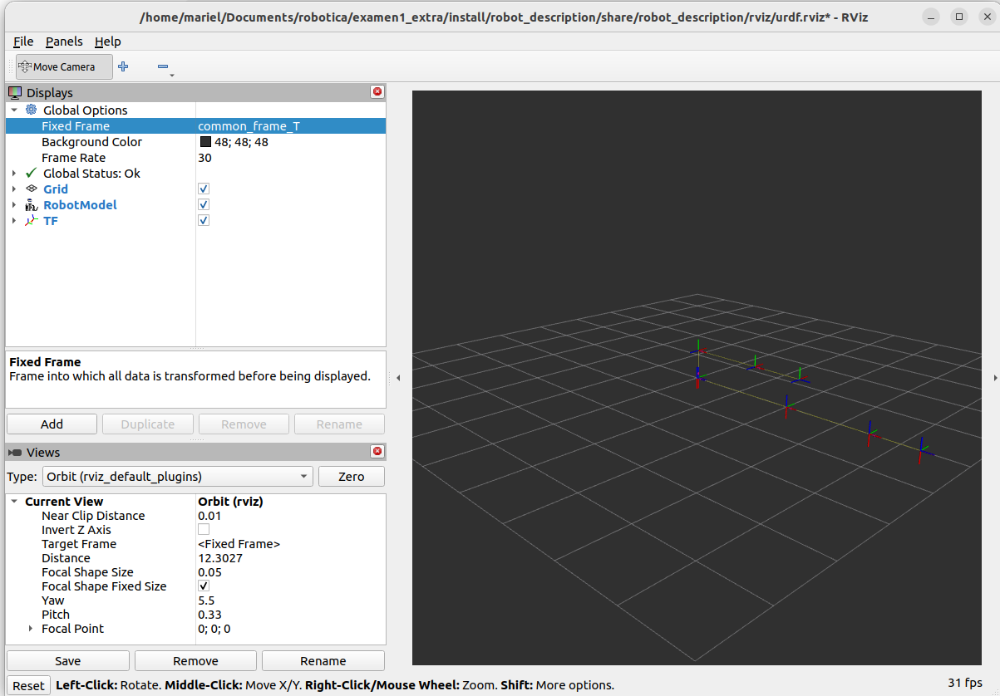
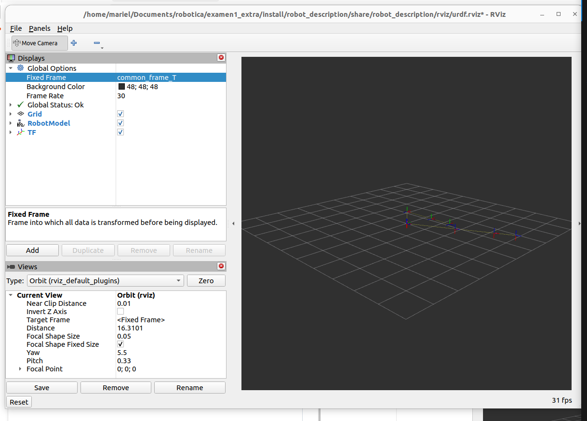

Este es mi ejercicio extra, donde integro la cinemática inversa del pulgar y del índice en un mismo frame T, como pide el ejercicio.

Pasos para ejecutar

- Abrir una terminal dentro del workspace y compilar el proyecto:

   colcon build
   source install/setup.bash

- Lanzar la visualización de los modelos:
  ros2 launch robot_description view_robot_pulgar_indice_cinematica_inversa.py

  Cambiar en RVIZ a common_frame_T

- Abrir una nueva terminal y ejecutar el nodo de cinemática inversa:
  ros2 run visual_pubsub inverse_kinematics_indice_pulgar

Inversa en RVIZ: 

